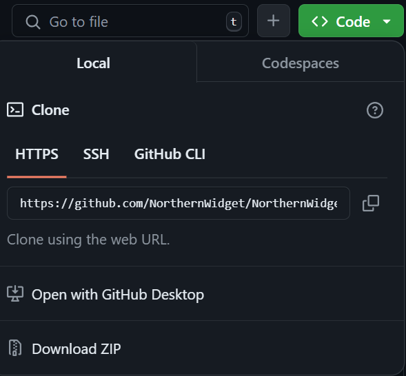

# Margay-guide
A guide on setting up and potentially troubleshooting a Margay data logger. A more thorough version of this exists [here](https://northernwidget.com/tutorial/), but this is written from the perspective of someone who's new to using Arduino boards and shows some of the issues/questions I had when getting started. 

### Physical materials needed

I started by gathering all the materials I'd need.

- Margay data logger (Mine was ATMega 1284p 8 MHz)
    - This is a small data logger that will eventually collect data in the field, but it needs to be set up and programmed before it can do that.
- Programmer (Mine was the AVR ISP mkll)
    - This is a device that will allow us to **burn a bootloader** (I'll define this below) onto the Margay board.
- USB-B cable
    - This is used to connect the programmer to the laptop. 
- USB-C cable
    - This is used to connect the *logger* to the laptop after initially burning a bootloader, to keep the logger connected to power. In the field, a battery would supply power.
- My laptop
    - To download softwares and upload programs to the Margay logger.
 
<div>
    <figure>
        
        <figcaption> Margay logger </figcaption>
    </figure>
    <figure>
        
        <figcaption> Programmer </figcaption>
    </figure>
    
    
</div>
<div clear: both> </div>

#### What is "burning a bootloader"? 

This just means that you make your Arduino board capable of receiving computer programs through a USB cable. You do not have to make any physical changes on the board to enable this. All you have to do is connect the board to your computer using the programmer (mentioned in the materials list) and install/configure a software on your computer. Then the board will have this ability from now on, so you won't have to do this more than once.

Most of this guide is about what you need to download on your computer in order to do this, and how you need to configure it.

### Software and library downloads

A quick list of downloads I made, before going into more detail on each:
- Arduino IDE
- Northern Widget libraries
    - Git Bash (used to install the libraries)
- SetTimeGUI
    - Processing

I downloaded the [Arduino IDE](https://www.arduino.cc/en/software), which will be used to write programs in Arduino and upload them to the logger.

Next, I downloaded the custom Northern Widget libraries found at the link https://github.com/NorthernWidget/NorthernWidget-libraries. There are detailed instructions in the readme, but I'll summarize here. First, I found where my Arduino libraries folder was. The standard location on Windows should be **My Documents\Arduino\libraries**. You can also find out by going to **File > Preferences** in the Arduino IDE, and looking at the Sketchbook location towards the top. For me, the Arduino folder in My Documents was empty (there was no libraries folder inside), so I created a "libraries" folder as a subfolder in my sketchbook location.

I downloaded the Northern Widget libraries using git so that updating them would be easier in the future, but had to download Git first ([available here](https://git-scm.com/downloads)). In the Git Bash application, I changed directories into my Arduino libraries folder, then went back to my browser and copied the link from the [NorthernWidget-libraries repository](https://github.com/NorthernWidget/NorthernWidget-libraries). (I clicked on the green **Code** button at the top of the page, then copied the link under the HTTPS option. More instructions for cloning in git are [here](https://docs.github.com/en/repositories/creating-and-managing-repositories/cloning-a-repository).) 
<div>
    
</div>
<div clear: both> </div>

In Git Bash, I entered 

`git clone https://github.com/NorthernWidget/NorthernWidget-libraries.git` 

using the link I had just copied. When I checked my Arduino libraries folder again, it now had a folder inside it called **NorthernWidget-libraries**. However, this folder had multiple subfolders inside, each its own library (for example, the Margay library folder is inside the Northern Widget library folder.) For the Arduino IDE to recognize the individual libraries, take the subfolders out of the NorthernWidget folder, and move them directly into the Arduino libraries folder. You can check whether it worked by hovering over **Sketch > Include Library** in the IDE, and seeing which libraries you've added. 

The last thing I downloaded was the SetTimeGUI, with download and running instructions on [this page](https://github.com/NorthernWidget/SetTime_GUI). For now, though, all I did was click the green Code button and use `git clone` to download the files in the repository (or you could download the zip file.) I needed to download [Processing](https://processing.org/download) too, in order to eventually run SetTime.

We should now have all the downloads we need, and only need to change some settings before we can start programming!

### Board, programmer, and port definitions
All of these changes are made in the Arduino IDE. 

Since I was using a Margay data logger (a board compatible with Arduino but considered a third-party instead of a standard Arduino board), I needed to configure some settings so that the IDE would recognize the board. A [guide](https://github.com/NorthernWidget/Arduino_Boards) for this already exists (with pictures), but I'll still summarize the steps I took. 

I went to **File > Preferences** in the IDE, and a window popped up, with "Additional Boards Manager URLs" towards the bottom. The field to enter text was empty for me at first, but I copy-pasted the following URL into that field and saved changes with **OK**. 
######
        https://raw.githubusercontent.com/NorthernWidget/Arduino_Boards/master/package_NorthernWidget_index.json

Then, I went to **Tools > Board > Boards Manager**, and it opened a panel on the side of the screen. I typed in "Northern", and the option for Northern Widget Data Logger AVR Boards came up. I clicked "Install". 

Now it was time to select which board I was using. The Margay logger has two versions: ATMega1284p 8MHz (the current version, so it's most likely this one), or ATMega644p 8MHz (older). If you're not sure, this is printed in really small font on the logger (I circled it in red in the picture below.) Mine was the 1284p. I made this selection in the IDE by going to **Tools > Board > Northern Widget Data Logger AVR Boards > ATMega1284p 8MHz**. 

<!-- Insert picture of 1284p here -->

I also had to tell the IDE which programmer I was using. The programmer is only necessary if this is the first time you're using your data logger, since we use the programmer to burn a bootloader (and again, we only have to do this once). The programmer should have a label on it to let you know which one it is - mine was the AVR ISP mkII. I selected this in **Tools > Programmer**.

### Burning the bootloader

Use the USB cable to connect your programmer to your computer. Also plug the programmer's ribbon cable into the Margay board, where the 2x3 pin header is. The ribbon should lie across the board rather than bumping against the ridge at the end of the board. However, it can be easy to mix this up, so just try again the other way if burning the bootloader fails.

Then go to **Tools > Burn Bootloader** in the Arduino IDE, and you should find out within a few seconds whether it worked. 

##### Troubleshooting

If it didn't work, the most common reason is that the programmer's cable is plugged into the board the wrong way. Flip it around and try again.

I was getting an error message relating to the USB port/driver in my laptop where the cable was plugged in. The option for me to select which port I was using in the IDE was grayed out. I downloaded [Zadig](https://zadig.akeo.ie/), which installs a USB driver. Once the Zadig window comes up, use the up/down arrows to select a driver. I chose libusbK. 
<div>
    
</div>
<div clear: both> </div>

Back in the Arduino IDE, I now had the option to select a port. Only one option came up for me: COM3, so I selected this, tried to burn a bootloader again, and it worked! 

### Testing

To test whether burning the bootloader had worked, I uploaded an example program to the board. I disconnected the programmer, and instead used the USB-C cable to connect the logger to my computer. 
<!-- insert picture of plugged in -->

A simple example program to test was at **File > Examples > 01.Basics > Blink**. As its documentation says, it turns the LED on the board on for a second, and off for a second repeatedly. I uploaded this to the logger by going to **Sketch > Upload**, and saw that the Arduino LED was blinking like expected.

#### _Margay-compatible program_

You'll need to upload a Margay-compatible program to the logger before you can set its clock. A Margay-compatible program is anything with the line `#include "Margay.h"`. 

One of these programs can be found by going to **File > Examples > Margay_Library > MargayDemo** in the Arduino IDE. Compile and upload this to the logger, and the LED may show a series of different colors. You can find out what they mean [here](https://github.com/NorthernWidget/Margay_Library). 

##### Troubleshooting

At the time that I compiled MargayDemo (August 2024), there were a few small syntax errors involving capitalization. These will probably be changed by now, but in case there's another program you're trying to compile that hasn't been updated, this is what to do if you get these error messages. 
- "Model_0v0" should be "MODEL_2v2". This error was in line 13, which at the time said `Margay Logger(Model_0v0);`. You can go into Margay.h (which you can open with the Notepad app on Windows), and the different options are under "enum board". This is what the error said:
    ```
     13:15: error: 'Model_0v0' was not declared in this scope
     Margay Logger(Model_0v0)
     13:15: note: suggested alternative: 'MODEL_0v0'
     Margay Logger(Model_0v0);
                   ^~~~~~~~~
                   MODEL_0v0
    ```
- "Logger.Run" should be "Logger.run". This error happened in line 21, which originally read `Logger.run(Update, UpdateRate);`, and the error message was:

    ```
    21:10: error: 'class Margay' has no member named 'Run'; did you mean 'run'?
    Logger.Run(Update, UpdateRate);
          ^~~
          Run
    ```
- This last error was a very weird fringe case. I'll start with the error message:

  ```
   156:3: error: 'MCP3421' does not name a type; did you mean 'CMCP3421'?
   MCP3421 adc;
   ^~~~~~~
   CMCP3421
   ```
  The error message mentioned MCP3421, which is a library included in the download from Northern Widget. However, when I opened the file MCP3421.h, the documentation said that Dirk Ohme created it. This means I somehow had Arduino's built-in MCP3421 library, instead of the Northern Widget library with the same name. I'm not entirely sure how I ended up with the wrong version, but a guess is that Arduino auto-installed it when a different library tried to import MCP3421 but couldn't find it. Then the auto-installed version must have overwritten the Northern Widget version. Anyway, the NW version should say it was written by Bobby Schulz. So if yours is the default Arduino version, delete it and re-install the Northern Widget MCP3421 library. 


